**This is a SIMPLFIED TUTORIAL of Unity ML agent, for a step-by-step workshop at ITP Unconference.**<br/>
**If you need a thorough info of Unity ML agent, please check their [official Github page](https://github.com/Unity-Technologies/ml-agents).**<br/>
**This workshop is for MacOS setting. + A computer mouse required**


# Contents
[Intro](#Intro)<br/>
[Install Unity ML](#Installation)<br/>
[Play with pre-trained environment](#Play-with-pre-trained-environment)<br/>
[Make your own environment](#Make-your-own-environment)<br/>
[References](#References)

# Intro
### What is Unity ML?<br/>
**The Unity Machine Learning Agents Toolkit** (ML-Agents) is an open-source
Unity plugin that enables games and simulations to serve as environments for
training intelligent agents. Agents can be trained using **reinforcement learning**,
**imitation learning**, **neuroevolution**, or other machine learning methods through a
simple-to-use Python API.<br/>
### What is reinforcement learning?<br/>
[Background: Machine Learning](https://github.com/Unity-Technologies/ml-agents/blob/master/docs/Background-Machine-Learning.md)

The goal of reinforcement learning is to learn a **policy**,
which is essentially a mapping from **observations** to **actions**. An
observation is what the robot can measure from its **environment** and an action, in its most raw form, is a change
to the configuration of the robot. The last remaining piece of the reinforcement learning task is the **reward
signal**. When training a robot to be a mean firefighting machine, we provide it
with rewards (positive and negative) indicating how well it is doing on
completing the task. 
<p align="center">
  
</p>

# Installation
To install and use ML-Agents, you need to install Unity, clone this repository and
install Python with additional dependencies. 

## Install **Unity 2017.4** or Later

[Download](https://store.unity.com/download) and install Unity.

## Windows Users
For setting up your environment on Windows, they have created a [detailed
guide](https://github.com/Unity-Technologies/ml-agents/blob/master/docs/Installation-Windows.md) to setting up your env. For Mac and Linux, continue with this guide.

## Mac and Unix Users

### Clone the ML-Agents Toolkit Repository

Once installed, you will want to clone the ML-Agents Toolkit GitHub repository.

```sh
git clone https://github.com/Unity-Technologies/ml-agents.git
```

The `UnitySDK` subdirectory contains the Unity Assets to add to your projects.

The `ml-agents` subdirectory contains Python packages which provide
trainers and a Python API to interface with Unity.

### Make Conda Python 3.6 Environment
[Download Anaconda for Python 3.7](https://www.anaconda.com/download/#macos)
```sh
conda install python=3.6
```
Create a new conda environment with python3.6
```sh
conda create -n [myenv] python=3.6
```
Now please activate the new created environment.
```sh
source activate [myenv]
```

FYI,you can deactivate the environment by
```sh
source deactivate
```
you can check your conda environments with
```sh
conda info --envs
```
and if you need to install any package with that environment, you can do
```sh
conda install -n [myenv] [packagename, ex)scipy]
```

### Install Python and mlagents Package

In order to use ML-Agents toolkit, you need **Python 3.6** along with the
dependencies listed in the [setup.py file](https://github.com/Unity-Technologies/ml-agents/blob/master/ml-agents/setup.py).

If your Python environment doesn't include `pip3`, see these
[instructions](https://linuxize.com/post/how-to-install-pip-on-ubuntu-18.04/#installing-pip-for-python-3)
on installing it.

To install the dependencies and `mlagents` Python package, enter the
`ml-agents/` subdirectory and run from the command line:

```sh
pip3 install -e .
```

If you installed this correctly, you should be able to run
`mlagents-learn --help`

# Play with pre-trained environment
## Setting up the ML-Agents Toolkit within Unity

In order to use the ML-Agents toolkit within Unity, you first need to change a few
Unity settings. 

1. Launch Unity
2. On the Projects dialog, choose the **Open** option at the top of the window.
3. Using the file dialog that opens, locate the `UnitySDK` folder
   within the the ML-Agents toolkit project and click **Open**.
4. Go to **Edit** > **Project Settings** > **Player**
5. For **each** of the platforms you target (**PC, Mac and Linux Standalone**,
   **iOS** or **Android**):
    1. Expand the **Other Settings** section.
    2. Select **Scripting Runtime Version** to **Experimental (.NET 4.6
       Equivalent or .NET 4.x Equivalent)**
6. Go to **File** > **Save Project**

## Setting up TensorFlowSharp

We provide pre-trained models (`.bytes` files) for all the agents 
in all our demo environments. To be able to run those models, you'll 
first need to set-up TensorFlowSharp support. Consequently, you need to install 
the TensorFlowSharp plugin to be able to run these models within the Unity 
Editor. 

1. Download the [TensorFlowSharp Plugin](https://s3.amazonaws.com/unity-ml-agents/0.5/TFSharpPlugin.unitypackage)
2. Import it into Unity by double clicking the downloaded file. You can check 
if it was successfully imported by checking the
TensorFlow files in the Project window under **Assets** > **ML-Agents** >
**Plugins** > **Computer**.
3. Go to **Edit** > **Project Settings** > **Player** and add `ENABLE_TENSORFLOW`
to the `Scripting Define Symbols` for each type of device you want to use 
(**`PC, Mac and Linux Standalone`**, **`iOS`** or **`Android`**).

   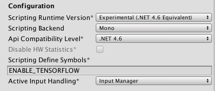

   **Note**: If you don't see anything under **Assets**, drag the
   `UnitySDK/Assets/ML-Agents` folder under **Assets** within Project window.

   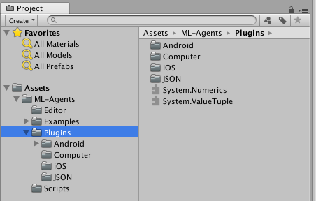
4. Also allow 'unsafe' code underneath it.

## Running a Pre-trained Model
We've included pre-trained models for the 3D Ball example.

1. In the **Project** window, go to the `Assets/ML-Agents/Examples/3DBall/Scenes` folder
   and open the `3DBall` scene file.
2. In the **Project** window, go to the `Assets/ML-Agents/Examples/3DBall/Prefabs` folder. 
   Expand `Game` and click on the `Platform` prefab.  You should see the `Platform` prefab in the **Inspector** window.
   
   **Note**: The platforms in the `3DBall` scene were created using the `Platform` prefab.  Instead of updating all 12 platforms individually, you can update the `Platform` prefab instead.
   
   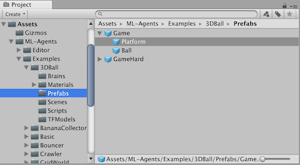
   
3. In the **Project** window, drag the **3DBallLearning** Brain located in 
   `Assets/ML-Agents/Examples/3DBall/Brains` into the `Brain` property under `Ball 3D Agent (Script)` component in the **Inspector** window.
   
   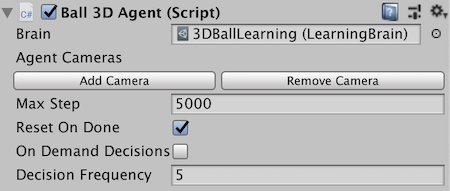
   
4. You should notice that each `Platform` under each `Game` in the **Hierarchy** windows now contains **3DBallLearning** as `Brain`. __Note__ : You can modify multiple game objects in a scene by selecting them all at 
   once using the search bar in the Scene Hierarchy. 
5. In the **Project** window, click on the **3DBallLearning** Brain located in 
   `Assets/ML-Agents/Examples/3DBall/Brains`.  You should see the properties in the **Inspector** window.
6. In the **Project** window, open the `Assets/ML-Agents/Examples/3DBall/TFModels` 
   folder.
7. Drag the `3DBallLearning` model file from the `Assets/ML-Agents/Examples/3DBall/TFModels` 
   folder to the **Model** field of the **3DBallLearning** Brain in the **Inspector** window. __Note__ : All of the brains should now have `3DBallLearning` as the TensorFlow model in the `Model` property 
8. Click the **Play** button and you will see the platforms balance the balls
   using the pretrained model.

   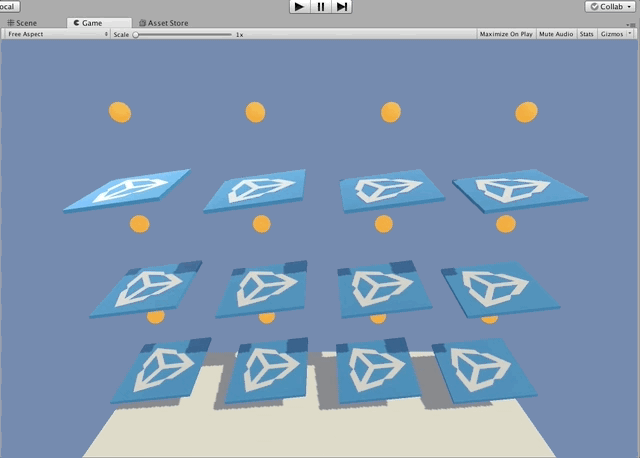

## Training the Brain with Reinforcement Learning

### Setting up the enviornment for training

To set up the environment for training, you will need to specify which agents are contributing
to the training and which Brain is being trained. You can only perform training with
a `Learning Brain`.

1. Each platform agent needs an assigned `Learning Brain`.  In this example, each platform agent was created using a prefab.  To update all of the brains in each platform agent at once, you only need to update the platform agent prefab.  In the **Project** window, go to the `Assets/ML-Agents/Examples/3DBall/Prefabs` folder. Expand `Game` and click on the `Platform` prefab.  You should see the `Platform` prefab in the **Inspector** window.  In the **Project** window, drag the **3DBallLearning** Brain located in  `Assets/ML-Agents/Examples/3DBall/Brains` into the `Brain` property under `Ball 3D Agent (Script)` component in the **Inspector** window.  

   **Note**: The Unity prefab system will modify all instances of the agent properties in your scene.  If the agent does not synchronize automatically with the prefab, you can hit the Revert button in the top of the **Inspector** window.

2. In the **Hierarchy** window, select `Ball3DAcademy`.
3. In the **Project** window, go to `Assets/ML-Agents/Examples/3DBall/Brains` folder and drag the **3DBallLearning** Brain to the `Brains` property under `Braodcast Hub` in the `Ball3DAcademy` object in the **Inspector** window.  In order to train, make sure the `Control` checkbox is selected.

   **Note:** Assigning a Brain to an agent (dragging a Brain into the `Brain` property of 
the agent) means that the Brain will be making decision for that agent. Whereas dragging
a Brain into the Broadcast Hub means that the Brain will be exposed to the Python process.
The `Control` checkbox means that in addition to being exposed to Python, the Brain will
be controlled by the Python process (required for training).

   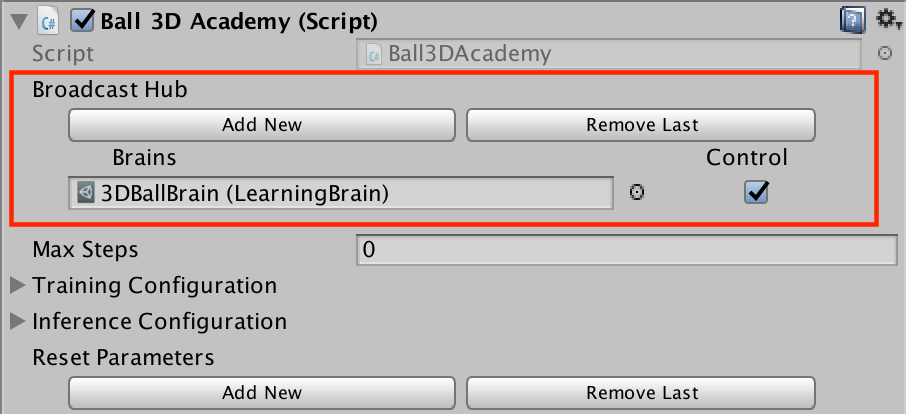

### Training the environment

1. Open a command or terminal window.
2. Navigate to the folder where you cloned the ML-Agents toolkit repository.
   **Note**: If you followed the default [installation](Installation.md), then
   you should be able to run `mlagents-learn` from any directory.
3. Run `mlagents-learn <trainer-config-path> --run-id=<run-identifier> --train`
   where:
    - `<trainer-config-path>` is the relative or absolute filepath of the
      trainer configuration. The defaults used by example environments included
      in `MLAgentsSDK` can be found in `config/trainer_config.yaml`.
    - `<run-identifier>` is a string used to separate the results of different
      training runs
    - `--train` tells `mlagents-learn` to run a training session (rather
      than inference)
4. If you cloned the ML-Agents repo, then you can simply run

      ```sh
      mlagents-learn config/trainer_config.yaml --run-id=firstRun --train
      ```

5. When the message _"Start training by pressing the Play button in the Unity
   Editor"_ is displayed on the screen, you can press the :arrow_forward: button
   in Unity to start training in the Editor.

   **Note**: Alternatively, you can use an executable rather than the Editor to
perform training. Please refer to [this
page](Learning-Environment-Executable.md) for instructions on how to build and
use an executable.

```console
ml-agents$ mlagents-learn config/trainer_config.yaml --run-id=first-run --train


                        ▄▄▄▓▓▓▓
                   ╓▓▓▓▓▓▓█▓▓▓▓▓
              ,▄▄▄m▀▀▀'  ,▓▓▓▀▓▓▄                           ▓▓▓  ▓▓▌
            ▄▓▓▓▀'      ▄▓▓▀  ▓▓▓      ▄▄     ▄▄ ,▄▄ ▄▄▄▄   ,▄▄ ▄▓▓▌▄ ▄▄▄    ,▄▄
          ▄▓▓▓▀        ▄▓▓▀   ▐▓▓▌     ▓▓▌   ▐▓▓ ▐▓▓▓▀▀▀▓▓▌ ▓▓▓ ▀▓▓▌▀ ^▓▓▌  ╒▓▓▌
        ▄▓▓▓▓▓▄▄▄▄▄▄▄▄▓▓▓      ▓▀      ▓▓▌   ▐▓▓ ▐▓▓    ▓▓▓ ▓▓▓  ▓▓▌   ▐▓▓▄ ▓▓▌
        ▀▓▓▓▓▀▀▀▀▀▀▀▀▀▀▓▓▄     ▓▓      ▓▓▌   ▐▓▓ ▐▓▓    ▓▓▓ ▓▓▓  ▓▓▌    ▐▓▓▐▓▓
          ^█▓▓▓        ▀▓▓▄   ▐▓▓▌     ▓▓▓▓▄▓▓▓▓ ▐▓▓    ▓▓▓ ▓▓▓  ▓▓▓▄    ▓▓▓▓`
            '▀▓▓▓▄      ^▓▓▓  ▓▓▓       └▀▀▀▀ ▀▀ ^▀▀    `▀▀ `▀▀   '▀▀    ▐▓▓▌
               ▀▀▀▀▓▄▄▄   ▓▓▓▓▓▓,                                      ▓▓▓▓▀
                   `▀█▓▓▓▓▓▓▓▓▓▌
                        ¬`▀▀▀█▓


INFO:mlagents.learn:{'--curriculum': 'None',
 '--docker-target-name': 'Empty',
 '--env': 'None',
 '--help': False,
 '--keep-checkpoints': '5',
 '--lesson': '0',
 '--load': False,
 '--no-graphics': False,
 '--num-runs': '1',
 '--run-id': 'first-run',
 '--save-freq': '50000',
 '--seed': '-1',
 '--slow': False,
 '--train': True,
 '--worker-id': '0',
 '<trainer-config-path>': 'config/trainer_config.yaml'}
INFO:mlagents.envs:Start training by pressing the Play button in the Unity Editor.
 ```

**Note**: If you're using Anaconda, don't forget to activate the ml-agents
environment first.

If `mlagents-learn` runs correctly and starts training, you should see something
like this:

```console
INFO:mlagents.envs:
'Ball3DAcademy' started successfully!
Unity Academy name: Ball3DAcademy
        Number of Brains: 1
        Number of Training Brains : 1
        Reset Parameters :

Unity brain name: 3DBallLearning
        Number of Visual Observations (per agent): 0
        Vector Observation space size (per agent): 8
        Number of stacked Vector Observation: 1
        Vector Action space type: continuous
        Vector Action space size (per agent): [2]
        Vector Action descriptions: ,
INFO:mlagents.envs:Hyperparameters for the PPO Trainer of brain 3DBallLearning:
        batch_size:          64
        beta:                0.001
        buffer_size:         12000
        epsilon:             0.2
        gamma:               0.995
        hidden_units:        128
        lambd:               0.99
        learning_rate:       0.0003
        max_steps:           5.0e4
        normalize:           True
        num_epoch:           3
        num_layers:          2
        time_horizon:        1000
        sequence_length:     64
        summary_freq:        1000
        use_recurrent:       False
        summary_path:        ./summaries/first-run-0
        memory_size:         256
        use_curiosity:       False
        curiosity_strength:  0.01
        curiosity_enc_size:  128
        model_path:	./models/first-run-0/3DBallLearning
INFO:mlagents.trainers: first-run-0: 3DBallLearning: Step: 1000. Mean Reward: 1.242. Std of Reward: 0.746. Training.
INFO:mlagents.trainers: first-run-0: 3DBallLearning: Step: 2000. Mean Reward: 1.319. Std of Reward: 0.693. Training.
INFO:mlagents.trainers: first-run-0: 3DBallLearning: Step: 3000. Mean Reward: 1.804. Std of Reward: 1.056. Training.
INFO:mlagents.trainers: first-run-0: 3DBallLearning: Step: 4000. Mean Reward: 2.151. Std of Reward: 1.432. Training.
INFO:mlagents.trainers: first-run-0: 3DBallLearning: Step: 5000. Mean Reward: 3.175. Std of Reward: 2.250. Training.
INFO:mlagents.trainers: first-run-0: 3DBallLearning: Step: 6000. Mean Reward: 4.898. Std of Reward: 4.019. Training.
INFO:mlagents.trainers: first-run-0: 3DBallLearning: Step: 7000. Mean Reward: 6.716. Std of Reward: 5.125. Training.
INFO:mlagents.trainers: first-run-0: 3DBallLearning: Step: 8000. Mean Reward: 12.124. Std of Reward: 11.929. Training.
INFO:mlagents.trainers: first-run-0: 3DBallLearning: Step: 9000. Mean Reward: 18.151. Std of Reward: 16.871. Training.
INFO:mlagents.trainers: first-run-0: 3DBallLearning: Step: 10000. Mean Reward: 27.284. Std of Reward: 28.667. Training.
```

### After training

You can press Ctrl+C to stop the training, and your trained model will be at
`models/<run-identifier>/<brain_name>.bytes` where
`<brain_name>` is the name of the Brain corresponding to the model.
(**Note:** There is a known bug on Windows that causes the saving of the model to
fail when you early terminate the training, it's recommended to wait until Step
has reached the max_steps parameter you set in trainer_config.yaml.) This file
corresponds to your model's latest checkpoint. You can now embed this trained
model into your Learning Brain by following the steps below, which is similar to
the steps described above.

1. Move your model file into
   `UnitySDK/Assets/ML-Agents/Examples/3DBall/TFModels/`.
2. Open the Unity Editor, and select the **3DBall** scene as described above.
3. Select the  **3DBallLearning** Learning Brain from the Scene hierarchy.
5. Drag the `<brain_name>.bytes` file from the Project window of
   the Editor to the **Model** placeholder in the **3DBallLearning**
   inspector window.
6. Press the :arrow_forward: button at the top of the Editor.

[More Info About UnitySDK environment setting](https://github.com/Unity-Technologies/ml-agents/blob/master/docs/Getting-Started-with-Balance-Ball.md)<br/>
[Using an Environment Executable](https://github.com/Unity-Technologies/ml-agents/blob/master/docs/Learning-Environment-Executable.md)

# Make your own environment
# Making a New Learning Environment

This tutorial walks through the process of creating a Unity Environment. A Unity
Environment is an application built using the Unity Engine which can be used to
train Reinforcement Learning Agents.


In this example, we will train a ball to roll to a randomly placed cube. The
ball also learns to avoid falling off the platform.

## Set Up the Unity Project

The first task to accomplish is simply creating a new Unity project and
importing the ML-Agents assets into it:

1. Launch the Unity Editor and create a new project named "RollerBall".
2. Make sure that the Scripting Runtime Version for the project is set to use 
    **.NET 4.x Equivalent** (This is an experimental option in Unity 2017, 
    but is the default as of 2018.3.)
3. In a file system window, navigate to the folder containing your cloned
    ML-Agents repository.
4. Drag the `ML-Agents` and `Gizmos` folders from `UnitySDK/Assets` to the Unity 
    Editor Project window.

Your Unity **Project** window should contain the following assets:

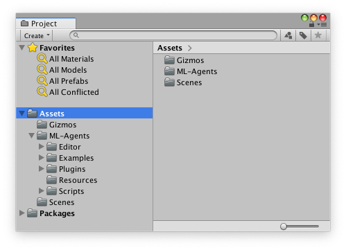

## Setting up TensorFlowSharp

1. Go to **Edit** > **Project Settings** > **Player** and add `ENABLE_TENSORFLOW`
to the `Scripting Define Symbols` for each type of device you want to use 
(**`PC, Mac and Linux Standalone`**, **`iOS`** or **`Android`**).

   

   **Note**: If you don't see anything under **Assets**, drag the
   `UnitySDK/Assets/ML-Agents` folder under **Assets** within Project window.

   
2. Also allow 'unsafe' code underneath it.


## Create the Environment

Next, we will create a very simple scene to act as our ML-Agents environment.
The "physical" components of the environment include a Plane to act as the floor
for the Agent to move around on, a Cube to act as the goal or target for the
agent to seek, and a Sphere to represent the Agent itself.

### Create the Floor Plane

1. Right click in Hierarchy window, select 3D Object > Plane.
2. Name the GameObject "Floor."
3. Select the Floor Plane to view its properties in the Inspector window.
4. Set Transform to Position = (0, 0, 0), Rotation = (0, 0, 0), Scale = (1, 1, 1).
5. On the Plane's Mesh Renderer, expand the Materials property and change the
    default-material to *LightGridFloorSquare* (or any suitable material of your choice).

(To set a new material, click the small circle icon next to the current material
name. This opens the **Object Picker** dialog so that you can choose a
different material from the list of all materials currently in the project.)

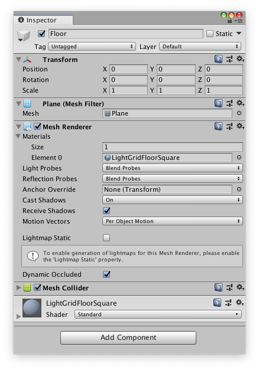

### Add the Target Cube

1. Right click in Hierarchy window, select 3D Object > Cube.
2. Name the GameObject "Target"
3. Select the Target Cube to view its properties in the Inspector window.
4. Set Transform to Position = (3, 0.5, 3), Rotation = (0, 0, 0), Scale = (1, 1, 1).
5. On the Cube's Mesh Renderer, expand the Materials property and change the
    default-material to *Block*.

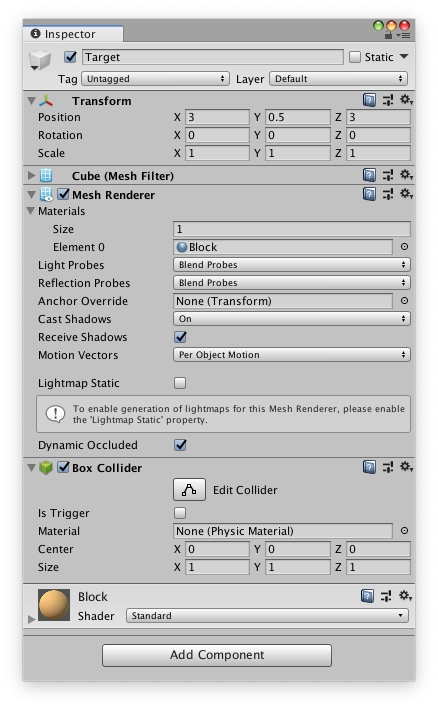

### Add the Agent Sphere

1. Right click in Hierarchy window, select 3D Object > Sphere.
2. Name the GameObject "RollerAgent"
3. Select the RollerAgent Sphere to view its properties in the Inspector window.
4. Set Transform to Position = (0, 0.5, 0), Rotation = (0, 0, 0), Scale = (1, 1, 1).
5. On the Sphere's Mesh Renderer, expand the Materials property and change the
    default-material to *CheckerSquare*.
6. Click **Add Component**.
7. Add the Physics/Rigidbody component to the Sphere.

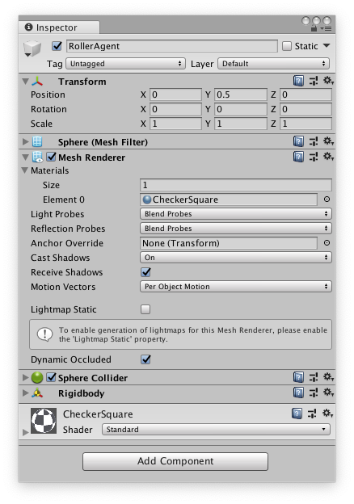

Note that we will create an Agent subclass to add to this GameObject as a
component later in the tutorial.

### Add an Empty GameObject to Hold the Academy

1. Right click in Hierarchy window, select Create Empty.
2. Name the GameObject "Academy"

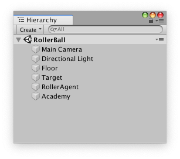

You can adjust the camera angles to give a better view of the scene at runtime.
The next steps will be to create and add the ML-Agent components.

## Implement an Academy

The Academy object coordinates the ML-Agents in the scene and drives the
decision-making portion of the simulation loop. Every ML-Agent scene needs one
Academy instance. Since the base Academy class is abstract, you must make your
own subclass even if you don't need to use any of the methods for a particular
environment.

First, add a New Script component to the Academy GameObject created earlier:

1. Select the Academy GameObject to view it in the Inspector window.
2. Click **Add Component**.
3. Click **New Script** in the list of components (at the bottom).
4. Name the script "RollerAcademy".
5. Click **Create and Add**.

Next, edit the new `RollerAcademy` script:

1. In the Unity Project window, double-click the `RollerAcademy` script to open
    it in your code editor. (By default new scripts are placed directly in the
    **Assets** folder.)
2. In the code editor, add the statement, `using MLAgents;`. 
3. Change the base class from `MonoBehaviour` to `Academy`.
4. Delete the `Start()` and `Update()` methods that were added by default.

In such a basic scene, we don't need the Academy to initialize, reset, or
otherwise control any objects in the environment so we have the simplest
possible Academy implementation:

```csharp
using MLAgents;

public class RollerAcademy : Academy { }
```

The default settings for the Academy properties are also fine for this
environment, so we don't need to change anything for the RollerAcademy component
in the Inspector window.

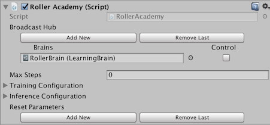

## Add Brain Assets

The Brain object encapsulates the decision making process. An Agent sends its
observations to its Brain and expects a decision in return. The type of the Brain
(Learning, Heuristic or Player) determines how the Brain makes decisions. 
To create the Brain:

1. Go to **Assets** > **Create** > **ML-Agents** and select the type of Brain asset
    you want to create. For this tutorial, create a **Learning Brain** and 
    a **Player Brain**.
2. Name them `RollerBallBrain` and `RollerBallPlayer` respectively.

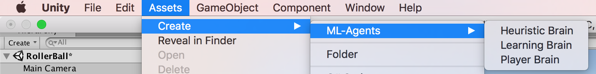

We will come back to the Brain properties later, but leave the Model property
of the `RollerBallBrain` as `None` for now. We will need to first train a 
model before we can add it to the **Learning Brain**.

## Implement an Agent

To create the Agent:

1. Select the RollerAgent GameObject to view it in the Inspector window.
2. Click **Add Component**.
3. Click **New Script** in the list of components (at the bottom).
4. Name the script "RollerAgent".
5. Click **Create and Add**.

Then, edit the new `RollerAgent` script:

1. In the Unity Project window, double-click the `RollerAgent` script to open it
   in your code editor.
2. In the editor, add the `using MLAgents;` statement and then change the base 
    class from `MonoBehaviour` to `Agent`.
3. Delete the `Update()` method, but we will use the `Start()` function, so
    leave it alone for now.

So far, these are the basic steps that you would use to add ML-Agents to any
Unity project. Next, we will add the logic that will let our Agent learn to roll
to the cube using reinforcement learning.

In this simple scenario, we don't use the Academy object to control the
environment. If we wanted to change the environment, for example change the size
of the floor or add or remove agents or other objects before or during the
simulation, we could implement the appropriate methods in the Academy. Instead,
we will have the Agent do all the work of resetting itself and the target when
it succeeds or falls trying.

### Initialization and Resetting the Agent

When the Agent reaches its target, it marks itself done and its Agent reset
function moves the target to a random location. In addition, if the Agent rolls
off the platform, the reset function puts it back onto the floor.

To move the target GameObject, we need a reference to its Transform (which
stores a GameObject's position, orientation and scale in the 3D world). To get
this reference, add a public field of type `Transform` to the RollerAgent class.
Public fields of a component in Unity get displayed in the Inspector window,
allowing you to choose which GameObject to use as the target in the Unity
Editor. 

To reset the Agent's velocity (and later to apply force to move the
agent) we need a reference to the Rigidbody component. A
[Rigidbody](https://docs.unity3d.com/ScriptReference/Rigidbody.html) is Unity's
primary element for physics simulation. (See
[Physics](https://docs.unity3d.com/Manual/PhysicsSection.html) for full
documentation of Unity physics.) Since the Rigidbody component is on the same
GameObject as our Agent script, the best way to get this reference is using
`GameObject.GetComponent<T>()`, which we can call in our script's `Start()`
method.

So far, our RollerAgent script looks like:

```csharp
using System.Collections.Generic;
using UnityEngine;
using MLAgents;

public class RollerAgent : Agent
{
    Rigidbody rBody;
    void Start () {
        rBody = GetComponent<Rigidbody>();
    }

    public Transform Target;
    public override void AgentReset()
    {
        if (this.transform.position.y < 0)
        {
            // If the Agent fell, zero its momentum
            this.rBody.angularVelocity = Vector3.zero;
            this.rBody.velocity = Vector3.zero;
            this.transform.position = new Vector3( 0, 0.5f, 0);
        }

        // Move the target to a new spot
        Target.position = new Vector3(Random.value * 8 - 4,
                                      0.5f,
                                      Random.value * 8 - 4);
    }
}
```

Next, let's implement the `Agent.CollectObservations()` method.

### Observing the Environment

The Agent sends the information we collect to the Brain, which uses it to make a
decision. When you train the Agent (or use a trained model), the data is fed
into a neural network as a feature vector. For an Agent to successfully learn a
task, we need to provide the correct information. A good rule of thumb for
deciding what information to collect is to consider what you would need to
calculate an analytical solution to the problem.

In our case, the information our Agent collects includes:

* Position of the target. 

```csharp
AddVectorObs(Target.position);
```

* Position of the Agent itself. 

```csharp
AddVectorObs(this.transform.position);
```

* The velocity of the Agent. This helps the Agent learn to control its speed so
    it doesn't overshoot the target and roll off the platform.

```csharp
// Agent velocity
AddVectorObs(rBody.velocity.x);
AddVectorObs(rBody.velocity.z);
```

In total, the state observation contains 8 values and we need to use the
continuous state space when we get around to setting the Brain properties:

```csharp
public override void CollectObservations()
{
    // Target and Agent positions
    AddVectorObs(Target.position);
    AddVectorObs(this.transform.position);

    // Agent velocity
    AddVectorObs(rBody.velocity.x);
    AddVectorObs(rBody.velocity.z);
}
```

The final part of the Agent code is the `Agent.AgentAction()` method, which
receives the decision from the Brain and assigns the reward.

### Actions

The decision of the Brain comes in the form of an action array passed to the
`AgentAction()` function. The number of elements in this array is determined by
the `Vector Action` `Space Type` and `Space Size` settings of the
agent's Brain. The RollerAgent uses the continuous vector action space and needs
two continuous control signals from the Brain. Thus, we will set the Brain
`Space Size` to 2. The first element,`action[0]` determines the force
applied along the x axis; `action[1]` determines the force applied along the z
axis. (If we allowed the Agent to move in three dimensions, then we would need
to set `Vector Action Size` to 3.) Note that the Brain really has no idea what the values in
the action array mean. The training process just adjusts the action values in
response to the observation input and then sees what kind of rewards it gets as
a result.

The RollerAgent applies the values from the `action[]` array to its Rigidbody
component, `rBody`, using the `Rigidbody.AddForce` function:

```csharp
Vector3 controlSignal = Vector3.zero;
controlSignal.x = action[0];
controlSignal.z = action[1];
rBody.AddForce(controlSignal * speed);
```

### Rewards

Reinforcement learning requires rewards. Assign rewards in the `AgentAction()`
function. The learning algorithm uses the rewards assigned to the Agent during 
the simulation and learning process to determine whether it is giving
the Agent the optimal actions. You want to reward an Agent for completing the
assigned task. In this case, the Agent is given a reward of 1.0 for reaching the 
Target cube.

The RollerAgent calculates the distance to detect when it reaches the target.
When it does, the code calls the `Agent.SetReward()` method to assign a
reward of 1.0 and marks the agent as finished by calling the `Done()` method 
on the Agent.

```csharp
float distanceToTarget = Vector3.Distance(this.transform.position,
                                          Target.position);
// Reached target
if (distanceToTarget < 1.42f)
{
    SetReward(1.0f);
    Done();
}
```

**Note:** When you mark an Agent as done, it stops its activity until it is
reset. You can have the Agent reset immediately, by setting the
Agent.ResetOnDone property to true in the inspector or you can wait for the
Academy to reset the environment. This RollerBall environment relies on the
`ResetOnDone` mechanism and doesn't set a `Max Steps` limit for the Academy (so
it never resets the environment).

Finally, if the Agent falls off the platform,  set the Agent to done so that it can reset itself:

```csharp
// Fell off platform
if (this.transform.position.y < 0)
{
    Done();
}
```

### AgentAction()

With the action and reward logic outlined above, the final version of the
`AgentAction()` function looks like:

```csharp
public float speed = 10;
public override void AgentAction(float[] vectorAction, string textAction)
{
    // Actions, size = 2
    Vector3 controlSignal = Vector3.zero;
    controlSignal.x = vectorAction[0];
    controlSignal.z = vectorAction[1];
    rBody.AddForce(controlSignal * speed);

    // Rewards
    float distanceToTarget = Vector3.Distance(this.transform.position,
                                              Target.position);

    // Reached target
    if (distanceToTarget < 1.42f)
    {
        SetReward(1.0f);
        Done();
    }

    // Fell off platform
    if (this.transform.position.y < 0)
    {
        Done();
    }

}
```

Note the `speed` class variable defined before the
function. Since `speed` is public, you can set the value from the Inspector
window.

## Final Editor Setup

Now, that all the GameObjects and ML-Agent components are in place, it is time
to connect everything together in the Unity Editor. This involves assigning the
Brain asset to the Agent, changing some of the Agent Component's properties, and
setting the Brain properties so that they are compatible with our Agent code.

1. In the Academy Inspector, add the `RollerBallBrain` and `RollerBallPlayer`
    Brains to the **Broadcast Hub**.
2. Select the **RollerAgent** GameObject to show its properties in the Inspector
    window.
3. Drag the Brain **RollerBallPlayer** from the Project window to the 
    RollerAgent **Brain** field.
4. Change **Decision Frequency** from `1` to `10`.
5. Drag the Target GameObject from the Hierarchy window to the RollerAgent
    Target field.

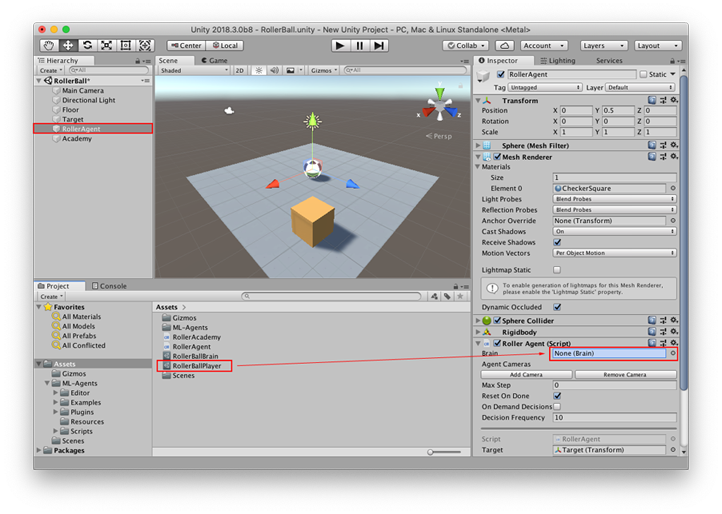

Finally, select the **RollerBallBrain** Asset in the **Project** window so that you can 
see its properties in the Inspector window. Set the following properties:

* `Vector Observation` `Space Size` = 8
* `Vector Action` `Space Type` = **Continuous**
* `Vector Action` `Space Size` = 2

***Select the **RollerBallPlayer** Asset in the **Project** window and set the same
property values.***

Now you are ready to test the environment before training.

## Testing the Environment

It is always a good idea to test your environment manually before embarking on
an extended training run. The reason we have created the `RollerBallPlayer` Brain
is so that we can control the Agent using direct keyboard
control. But first, you need to define the keyboard to action mapping. Although
the RollerAgent only has an `Action Size` of two, we will use one key to specify
positive values and one to specify negative values for each action, for a total
of four keys.

1. Select the `RollerBallPlayer` Aset to view its properties in the Inspector.
2. Expand the **Key Continuous Player Actions** dictionary (only visible when using
    a **PlayerBrain**).
3. Set **Size** to 4.
4. Set the following mappings:

| Element   | Key | Index | Value |
| :------------ | :---: | :------: | :------: |
| Element 0 | D   | 0        | 1        |
| Element 1 | A    | 0        | -1       |
| Element 2 | W  | 1        | 1        |
| Element 3 | S   | 1        | -1       |

The **Index** value corresponds to the index of the action array passed to
`AgentAction()` function. **Value** is assigned to action[Index] when **Key** is
pressed.

Press **Play** to run the scene and use the WASD keys to move the Agent around
the platform. Make sure that there are no errors displayed in the Unity editor
Console window and that the Agent resets when it reaches its target or falls
from the platform. Note that for more involved debugging, the ML-Agents SDK
includes a convenient Monitor class that you can use to easily display Agent
status information in the Game window.

## Training the Environment

Now you can train the Agent. To get ready for training, ***you must first to change
the `Brain` of the agent to be the Learning Brain `RollerBallBrain`.***
Then, select the Academy GameObject and check the `Control` checkbox for 
the RollerBallBrain item in the **Broadcast Hub** list. From there, the process is
the same as described in [Training ML-Agents](Training-ML-Agents.md).

The hyperparameters for training are specified in the configuration file that you ls
pass to the `mlagents-learn` program. Using the default settings specified 
in the `config/trainer_config.yaml` file (in your ml-agents folder), the
RollerAgent takes about 300,000 steps to train. However, you can change the 
following hyperparameters  to speed up training considerably (to under 20,000 steps):

    batch_size: 10
    buffer_size: 100

Since this example creates a very simple training environment with only a few inputs 
and outputs, using small batch and buffer sizes speeds up the training considerably. 
However, if you add more complexity to the environment or change the reward or 
observation functions, you might also find that training performs better with different 
hyperparameter values.

**Note:** In addition to setting these hyperparameter values, the Agent 
**DecisionFrequency** parameter has a large effect on training time and success.
A larger value reduces the number of decisions the training algorithm has to consider and,
in this simple environment, speeds up training. 

To train in the editor, run the following Python command from a Terminal or Console 
window before pressing play:

    mlagents-learn config/[new_config_we_made].yaml --run-id=RollerBall-1 --train

(where `config.yaml` is a copy of `trainer_config.yaml` that you have edited 
to change the `batch_size` and `buffer_size` hyperparameters for your brain.)

**Note:** If you get a `command not found` error when running this command,  make sure 
that you have followed the *Install Python and mlagents Package* section of the 
ML-Agents [Installation](Installation.md) instructions.

### After training

You can press Ctrl+C to stop the training, and your trained model will be at
`models/<run-identifier>/<brain_name>.bytes` where
`<brain_name>` is the name of the Brain corresponding to the model. This file
corresponds to your model's latest checkpoint. You can now embed this trained
model into your Learning Brain by following the steps below, which is similar to
the steps described

1. Drag your model file into `ML-Agents` to the `Project' window.
2. Unlock the `Control` checkbox from `Academy` Gameobject.
3. Select the  **3DBallLearning** Learning Brain from the Scene hierarchy.
4. Drag the `<brain_name>.bytes` file from the Project window of
   the Editor to the **Model** placeholder in the **RollerBallBrain**
   inspector window.
5. Press the :arrow_forward: button at the top of the Editor.


[More Info](https://github.com/Unity-Technologies/ml-agents/blob/master/docs/Learning-Environment-Create-New.md)

# References
[Unity ML-Agents Toolkit Documentation](https://github.com/Unity-Technologies/ml-agents/blob/master/docs/Readme.md)<br/>
[If you don't see Python3 in your iPython file when you work with Jupyter Notebook](https://stackoverflow.com/questions/28831854/how-do-i-add-python3-kernel-to-jupyter-ipython)
