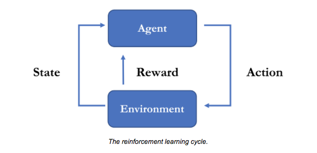

**This is a SIMPLFIED TUTORIAL of Unity ML agent, for a step-by-step workshop at ITP Unconference.**<br/>
**If you need a thorough info of Unity ML agent, please check their [official Github page](https://github.com/Unity-Technologies/ml-agents).**<br/>
**This workshop is for MacOS setting.**

# Contents
[Intro](#Intro)<br/>
[Install Unity ML](#Installation)<br/>
[Play with pre-trained environment](#Play-with-pre-trainedenvironment)<br/>
Make your own environment <br/>
References(#References)

# Intro
### What is Unity ML?<br/>
**The Unity Machine Learning Agents Toolkit** (ML-Agents) is an open-source
Unity plugin that enables games and simulations to serve as environments for
training intelligent agents. Agents can be trained using **reinforcement learning**,
**imitation learning**, **neuroevolution**, or other machine learning methods through a
simple-to-use Python API.<br/>
### What is reinforcement learning?<br/>
[Background: Machine Learning](https://github.com/Unity-Technologies/ml-agents/blob/master/docs/Background-Machine-Learning.md)

The goal of reinforcement learning is to learn a **policy**,
which is essentially a mapping from **observations** to **actions**. An
observation is what the robot can measure from its **environment** and an action, in its most raw form, is a change
to the configuration of the robot. The last remaining piece of the reinforcement learning task is the **reward
signal**. When training a robot to be a mean firefighting machine, we provide it
with rewards (positive and negative) indicating how well it is doing on
completing the task. 
<p align="center">
  
</p>

# Installation
To install and use ML-Agents, you need to install Unity, clone this repository and
install Python with additional dependencies. 

## Install **Unity 2017.4** or Later

[Download](https://store.unity.com/download) and install Unity.

## Windows Users
For setting up your environment on Windows, they have created a [detailed
guide](https://github.com/Unity-Technologies/ml-agents/blob/master/docs/Installation-Windows.md) to setting up your env. For Mac and Linux, continue with this guide.

## Mac and Unix Users

### Clone the ML-Agents Toolkit Repository

Once installed, you will want to clone the ML-Agents Toolkit GitHub repository.

```sh
git clone https://github.com/Unity-Technologies/ml-agents.git
```

The `UnitySDK` subdirectory contains the Unity Assets to add to your projects.

The `ml-agents` subdirectory contains Python packages which provide
trainers and a Python API to interface with Unity.

### Make Conda Python 3.6 Environment
[Download Anaconda for Python 3.7](https://www.anaconda.com/download/#macos)
```sh
conda install python=3.6
```
Create a new conda environment with python3.6
```sh
conda create -n [myenv] python=3.6
```
Now please activate the new created environment.
```sh
source activate [myenv]
```

FYI,you can deactivate the environment by
```sh
source deactivate
```
you can check your conda environments with
```sh
conda info --envs
```
and if you need to install any package with that environment, you can do
```sh
conda install -n [myenv] [packagename, ex)scipy]
```

### Install Python and mlagents Package

In order to use ML-Agents toolkit, you need **Python 3.6** along with the
dependencies listed in the [setup.py file](https://github.com/Unity-Technologies/ml-agents/blob/master/ml-agents/setup.py).

If your Python environment doesn't include `pip3`, see these
[instructions](https://linuxize.com/post/how-to-install-pip-on-ubuntu-18.04/#installing-pip-for-python-3)
on installing it.

To install the dependencies and `mlagents` Python package, enter the
`ml-agents/` subdirectory and run from the command line:

```sh
pip3 install -e .
```

If you installed this correctly, you should be able to run
`mlagents-learn --help`

# Play with pre-trained environment

[More Info About UnitySDK](https://github.com/Unity-Technologies/ml-agents/blob/master/docs/Getting-Started-with-Balance-Ball.md)
# References
[Unity ML-Agents Toolkit Documentation](https://github.com/Unity-Technologies/ml-agents/blob/master/docs/Readme.md)
